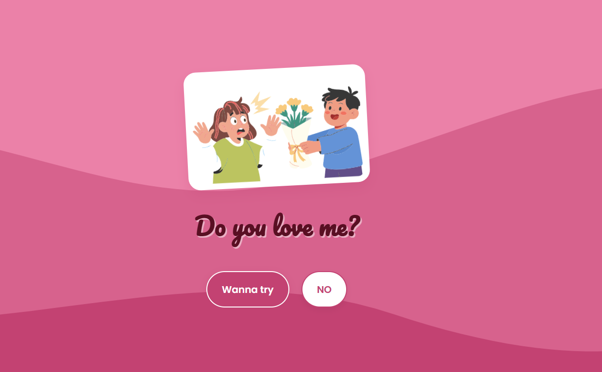

# 💖 Do You Wanna Impress Your GF?

**This would be the best way to impress her by making a website!** 🚀

This is a cute, interactive, and mobile-friendly webpage designed to make your special someone smile. It features playful animations, a "runaway" button, and a sweet surprise ending with your photo!

## 📸 Previews

  
   

## ✨ Features

*   **Interactive Flow**: A "Wanna try" button that leads to a fun "Are you sure?" sequence.
*   **Evasive "NO" Button**: The "NO" button runs away when you try to click it—she *has* to say yes!
*   **Cute Animations**: Characters fade and slide in to set the mood.
*   **Success Celebration**: Confetti hearts and your favorite photo appear at the end.
*   **Mobile Friendly**: Looks great on phones so you can show her anywhere.

## 🛠️ How to Customize

1.  **Photos**:
    *   Replace `assets/final_photo.jpg` with a photo of you two!
    *   (Optional) You can also replace the character SVGs in `assets/` if you want.
2.  **Text**:
    *   Edit `index.html` or `script.js` to change the playful text messages.

## 🚀 How to Run

Simply open `index.html` in any web browser!

  <em>Made by <a href="https://github.com/Shourov-Paul">Shourouv-paul</a> with love (and code).</em> ❤️

